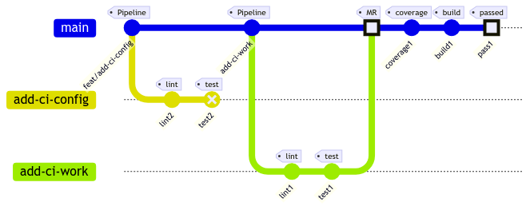
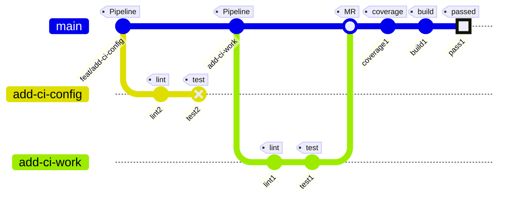

# RFC: Odin Skeleton Boilerplate Project Structure.

| Title              | Subject            |
|--------------------|--------------------|
| Authors:           | Nanang Suryadi     |
| To be reviewed by: |                    |
| Revisit Date:      |                    |
| State:             | Feedback Requested |

## TL;DR:

### TODOS:
* [ ] project layout
* [x] routing - [chi](https://github.com/go-chi/chi)
* [ ] adapters - Mysql, Sqlite and Postgresql - [ent.](https://entgo.io/)
* [x] api rest
* [ ] api grpc
* [x] logging - [zerolog](https://github.com/rs/zerolog)
* [x] tracing - [openTelemetry](https://opentelemetry.io/)
* [x] metric - [openTelemetry](https://opentelemetry.io/)
* [x] graceful service degradation [shutdown](https://gitlab.playcourt.id/nanang_suryadi/odin/-/blob/master/pkg/shared/shutdown.go#L15)

### Need

We have several issues when onboarding new Backend Engineers, and we don't have a standardization.
Each team has a different layout project. We must define layout and gameplay when we build services.

* Define standard project layout.
* Basic standard of observability e.g. logging, metrics and tracing.
* Error handling.
* Basic library e.g. http, grpc, orm or router.
* Conventional Commits and merge request standard.
* Lint and Unit Testing.

### Approach

#### Define standard project layout.

We can discuss the structure and decide to implement and adopt it for Backend Engineer.

*Here structure of the layout.*

```
.
+-- cmd
|   +-- bin
|   |   +-- main.go
|   +-- description.go
|   +-- migrate.go
|   +-- root.go
|   +-- version.go
+-- pkg
|   +-- adapters
|   +-- api
|   +-- rest
|   |   +-- handler_<domain_name>.go
|   |   +-- grpc (optional)
|   |   |   +-- pb
|   |   |   +-- proto
|   |   |   +-- server_<domain_name>.go
|   +-- infrastructure
|   |   +-- config.go
|   |   +-- logging.go
|   |   +-- metric.go
|   |   +-- tracing.go
|   +-- ports
|   |   +-- rest
|   |   |   +-- error.go
|   |   |   +-- media_types.go
|   |   |   +-- middleware.go
|   |   |   +-- request.go
|   |   |   +-- response.go
|   |   |   +-- router.go
|   |   |   +-- server.go
|   |   |   +-- server_options.go
|   |   |   +-- status_code.go
|   |   +-- grpc (optional)
|   +-- shared
|   |   +-- tracer
|   |   |   +-- chi_middleware.go
|   |   |   +-- config.go
|   |   +-- ent.go
|   |   +-- shutdown.go
|   |   +-- signal.go
|   |   +-- signal_posix.go
|   |   +-- signal_windows.go 
|   +-- version
|   |   +-- base.go
|   |   +-- version.go
+-- .env.defaultexample
+-- .dockerignore
+-- .gitignore
+-- .gitlab-ci.yml
+-- .golangci.yaml
+-- .ymir.yaml
+-- config.yaml
+-- CONTRIBUTING.md
+-- go.mod
+-- go.sum
+-- LICENSE
+-- MAINTAINER.md
+-- README.md
+-- Taskfile.yaml
```

#### Basic standard of observability.

Basic observability is in the infrastructure package.

* Middleware - for rest middleware tracing is custom-built in shared\tracer package.
* Logging using zerolog

Logging Format 

| Usage                                                                      | Stage       | Format                                                                                                                                                                                                                                                                                                                                                                                                          |
|----------------------------------------------------------------------------|-------------|-----------------------------------------------------------------------------------------------------------------------------------------------------------------------------------------------------------------------------------------------------------------------------------------------------------------------------------------------------------------------------------------------------------------|
| `log.Info().Str("Hello",  "World"). Msg("this")`                           | Development | ` 9:37AM INF pkg\api\rest\handler_hello.go:36 >  this Hello=World span.context="{\"TraceID\":\"70b09aa00d286ee49d9aae5e21223275\",\"SpanID\":\"f59767c60798e2fe\",\"TraceFlags\":\"01\",\"TraceState\":\"\",\"Remote\":false}" span.id=f59767c60798e2fe trace.id=70b09aa00d286ee49d9aae5e21223275`                                                                                                              |
| `log.Info().Str("Hello",  "World"). Msg("this")`                           | Staging     | `{"level":"info","Hello":"World","time":1677207725,"caller":"C:/Users/nanan/Documents/Projects/Telkom/repos/odin/pkg/api/rest/handler_hello.go:36","span.context":"{\"TraceID\":\"2c018c1052ac8a52c32959071586fe1a\",\"SpanID\":\"94660c8582a33d2b\",\"TraceFlags\":\"01\",\"TraceState\":\"\",\"Remote\":false}","trace.id":"2c018c1052ac8a52c32959071586fe1a","span.id":"94660c8582a33d2b","message":"this"}` |
| `log.Error().Err(fmt.Errorf("ini sebuah kesalahan")).Msg("handler World")` | Staging     | `{"level":"error","error":"ini sebuah kesalahan","time":1677220914,"caller":"C:/Users/nanan/Documents/Projects/Telkom/repos/odin/pkg/api/rest/handler_hello.go:33","message":"handler World"}`                                                                                                                                                                                                                  |

#### Error handling.

* http error status code

```go
package rest

import "fmt"

// ErrBadRequest error http StatusBadRequest.
func ErrBadRequest(w http.ResponseWriter, r *http.Request, err error) error {
  *r = *r.WithContext(context.WithValue(r.Context(), CtxStatusCode, http.StatusBadRequest))
  w.Header().Set("X-Content-Type-Options", "nosniff")
  w.WriteHeader(http.StatusBadRequest)
  return err
}

// http handler
func handler(w http.ResponseWriter, r *http.Request) error {
  return rest.ErrBadRequest(w, r, fmt.Errorf("terjadi kesalahan di request"))
} 
```

#### Basic library.

* Routing Handle on REST using [chi](https://github.com/go-chi/chi) *lightweight, idiomatic and composable router for
  building Go HTTP services.*
* ORM Schema generator using  [ent.](https://entgo.io/) *An entity framework for Go.*
* Observability using [openTelemetry](https://opentelemetry.io/) High-quality, ubiquitous, and portable telemetry to
  enable effective
  observability.
* Logging handler using [zerolog](https://github.com/rs/zerolog) Zero Allocation JSON Logger.

#### Conventional Commits and merge request standard.

For conventional commits, we can adopt https://www.conventionalcommits.org. golang helper we should
use [git-chglog](https://github.com/git-chglog/git-chglog) to generate changelog (CHANGELOG.md) before merging to
release branch.

#### Lint and Unit Testing.

* For Go Linter using [golanci-lint](https://golangci-lint.run/usage/install/) .
* For Unit Testing can be used built-in test package.

### Benefits

With this standard, it is hoped that it can be applied to all backend golang codebases and makes the onboarding process
easy.

### Runner CI

Diagram Flow CI

<p></p>



### Reference:

* https://gitlab.playcourt.id/nanang_suryadi/odin
* https://github.com/git-chglog/git-chglog

